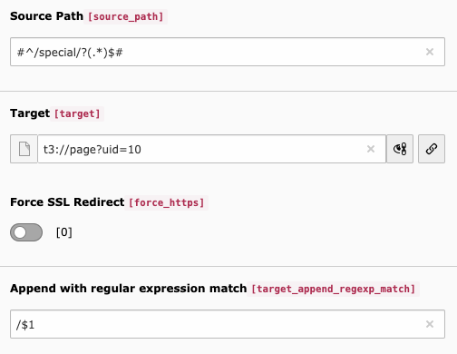

# umleitung

TYPO3 CMS Redirects site base agnostic and with fuzzy target

## Installation

Add the extension with composer

```
composer require wazum/umleitung
```

The extension has no settings, just activate it and you're done.

## What does it do?

### Site base agnostic redirects

The default TYPO3 redirect middleware is inserted after the site base resolver middleware,
therefore it's impossible to add a redirect without a language prefix if all of your sites have one configured.

E.g. you have two Sites configured with 

```
/en
/de
```

and your marketing department tells you to add a redirect 
without a language specific prefix for
 
```
https://big-company.com/new-product/  -> https://big-company.com/en/products/security/brand-new/
```

and you know how these guys work … they'll change their mind next month and call you again to adapt the redirect then,
so you don't want to add the rewrite on the server.

Until now you'll always get a 404 not found because the Site base can't be resolved and that happens always
before the redirect handling.

This extension changes the order of middlewares and inserts the redirect handling before the 
site base resolving to make this work.

### Variant source redirects

If you have a Site configuration with multiple variants and redirects with a specific hostname,
redirects won't match by default for a variant. The extension uses configured variants and a redirect
matches for all of them.

### Fuzzy target redirects

The extension adds a new field to redirects where you can append a fuzzy target for the redirect.

Lets say you are in the middle of a relaunch and have the following structure:

```
/institute-a/standard/about
/institute-a/standard/team
/institute-a/standard/contact
```

and your boss tells you to move all those pages to 

```
/institute-a/special/…
```

after the relaunch.

Either you create all these rewrites on the server (nginx, Apache)
or you create redirects in TYPO3 for every single page.

This is tedious work, so now you simply set a regular expression to match:

```
#^/institute-a/normal/?(.*)$#
```

and specify the first matched group to append:

```
/$1
```

in the new field and you're done.

Keep in mind that you have to take care, that the sub pages exist and have the same path as before.
But since this should only be a temporary solution for a while, this shouldn't be a problem.


